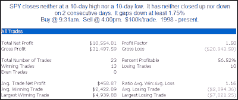

<!--yml
category: 未分类
date: 2024-05-18 13:15:34
-->

# Quantifiable Edges: Big Gaps From Congestion

> 来源：[http://quantifiableedges.blogspot.com/2009/08/big-gaps-from-congestion.html#0001-01-01](http://quantifiableedges.blogspot.com/2009/08/big-gaps-from-congestion.html#0001-01-01)

In the past I've looked at gaps that occured after the marekt was already extended. This morning the market is set to open down big. It closed Friday in the middle of its recent range and was not extended. Below is one way to look at it.

(click to enlarge)

There appears to be a mild upside edge, though it's nowhere near as strong as it would be if the market were already extended downwards.