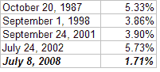

<!--yml
category: 未分类
date: 2024-05-18 08:12:41
-->

# Quantifiable Edges: Bounce Not Impressive So Far

> 来源：[http://quantifiableedges.blogspot.com/2008/07/bounce-not-impressive-so-far.html#0001-01-01](http://quantifiableedges.blogspot.com/2008/07/bounce-not-impressive-so-far.html#0001-01-01)

[Last night I discussed the T2116 indicator](http://quantifiableedges.blogspot.com/2008/07/another-breadth-indicator-hitting.html)

. I noted that since 1986 there were only four other periods of time where the indicator had risen above the 58.1% level where it stood yesterday. Each instance would have been an opportunistic time to be long.

On Tuesday the market bounced. The S&P 500 managed to rise 1.71%. As far as oversold, short-covering rallies it didn’t seem particularly viscous. Below is a comparison of how it fared against the first day bounce the other 4 times the T2116 rose to 58.1% or above:

Today doesn’t even come close to those. It’s less than half the “worst” ones.

Does it matter?

[Back in March, I posted a study](http://quantifiableedges.blogspot.com/2008/03/cbi-of-15-precludes-bottom-explosion.html)

that looked at explosions of 3.5% or more following a 100-day low. The results were quite impressive. Tonight I broke down the results by percentage gained on the fist up day. I looked at 3 periods – 5, 10, and 15 days out. Results below:

For every time period, results were substantially better if the move was 3% or better. Below 3% and the results were sketchy. There appears to be a slight upside edge 5 days out, and slight downside edges 10 and 15 days out.

I also looked at today’s volume and breadth statistics and found nothing substantial. The market was certainly oversold enough that it could put in a rally over the next few days and weeks, but today’s start was not impressive.