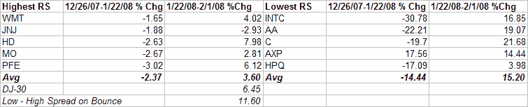
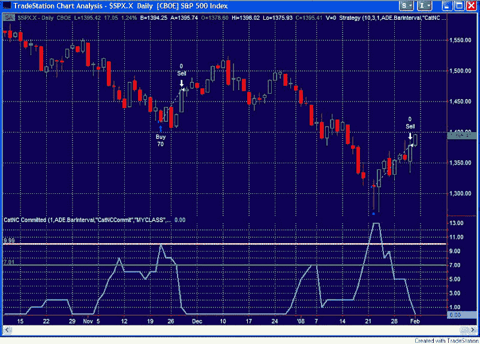

<!--yml
category: 未分类
date: 2024-05-18 08:35:27
-->

# Quantifiable Edges: Breadth Follow Up & CBI and Bounce Candidates Closure

> 来源：[http://quantifiableedges.blogspot.com/2008/02/breadth-follow-up-cbi-and-bounce.html#0001-01-01](http://quantifiableedges.blogspot.com/2008/02/breadth-follow-up-cbi-and-bounce.html#0001-01-01)

**Lowry's Breadth** 

First, a quick follow up to

[my post on breadth yesterday](http://quantifiableedges.blogspot.com/2008/02/whose-breadth-stinks.html)

. It was pointed out to me that Thursday and Friday may have qualified as back to back 80% Days.

[In Lowry’s report](http://www.lowryresearch.com/research_studies.cfm)

, back to back 80% days can substitute for one 90% day at some bottoms. I said “may” qualify, because according to my data (which could be wrong)**, Thursday was a 79.61% upside volume day. This could qualify as 80% by human standards, but perhaps not by computer standards. Anyway, certainly seems close enough to quell some of the concerns I’d previously expressed about the lack of a 90% day…

**Bounce Candidates Closure**

Back on the night of the 21st as the futures were down about 5%

[I wrote a post](http://quantifiableedges.blogspot.com/2008/01/what-stocks-will-benefit-most-when.html)

showing that market bounces from extremely oversold and capitulative conditions typically see the most beat up stocks bounce the best – and by a substantial amount. I looked at Dow stocks to illustrate this. I also listed the 5 worst performing and best performing Dow stocks from December 26th through January 18th. The time frame I looked at for the intial move off the lows in that study was 6-8 days. It has now been 8 trading days since the market bottomed, so I thought it might be interesting to see how things played out this time. Below are the stocks I listed in the previous column along with the results:

Once again the Lowest RS stocks trounced the Highest RS stocks by more than the Dow itself bounced. In fact 4 of the top 6 performing Dow stocks during the bounce were among the 5 “Lowest RS” stocks I listed.

**Capitulative Breadth Indicator (CBI) Returns to Zero** 

For those that haven’t been paying close attention, the

[CBI](http://quantifiableedges.blogspot.com/2008/01/my-capitulative-breadth-indicator.html)

closed at 2 on Thursday and 0 on Friday. While I suggested taking at least partial profits earlier, Thursday’s move below 4 would have signaled the exit to the standard CBI trade I’ve discussed in the past. Below is a graph showing the action in the CBI going back to October. Buying the close on the 22nd and holding until Thursday’s close would have been worth about 5% in the S&P 500\. Of course with some stock selection such as described in the Dow example above, traders may have done significantly better.

Incidentally, a zero CBI is not a signal to short. The CBI only measures "oversold" - not "overbought".

**9:55 am - Edit - I've now been told my data is in conflict with others who show 1/31 to be about 82% upside volume.