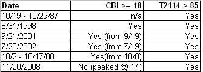

<!--yml
category: 未分类
date: 2024-05-18 13:26:26
-->

# Quantifiable Edges: Breadth Indicators With Confirming Extremes

> 来源：[http://quantifiableedges.blogspot.com/2009/03/breadth-indicators-with-confirming.html#0001-01-01](http://quantifiableedges.blogspot.com/2009/03/breadth-indicators-with-confirming.html#0001-01-01)

Yesterday I noted my Capitulative Breadth Indicator (CBI) spiked above 10 up to 12\. On Tuesday the number reached even higher to 18\. Eighteen is an extreme reading that has only been reached during 5 other periods since 1995.

Before I show those dates I want to mention another breadth indicator I look at which also measures oversold breadth. Worden Bros. T2114 and T2116 measure the % of stocks trading 1 and 2 standard deviations below their 40-day moving average. Both are in extreme territory at the current time. T2114 (1 standard deviation stretch) is reading almost 87% currently. Data is available back to 1986\. Since then there have only been 6 other periods where similar levels were reached.

Below is a table comparing the CBI>=18 to a Worden Bros. T2114 > 85:

Both indicators are now at similar extremes only reached during some sharp selloffs that resulted in sharp rebounds.