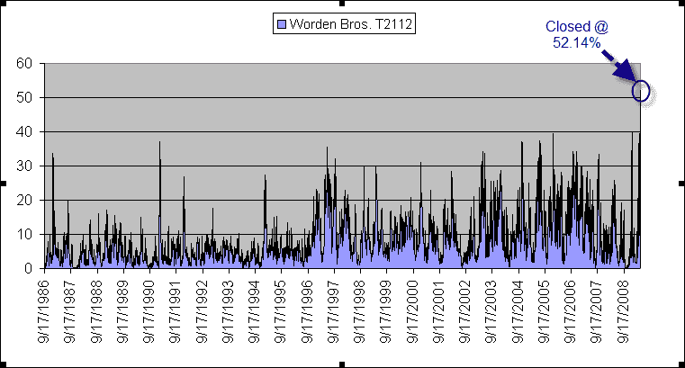

<!--yml
category: 未分类
date: 2024-05-18 13:22:17
-->

# Quantifiable Edges: Breadth Measures Hitting Historical Highs

> 来源：[http://quantifiableedges.blogspot.com/2009/05/breadth-measures-hitting-historical.html#0001-01-01](http://quantifiableedges.blogspot.com/2009/05/breadth-measures-hitting-historical.html#0001-01-01)

I’m seeing some breadth measures again hitting all-time extremes. Worden Bros. measures the % of stocks trading at least 1 and 2 standard deviations above their 40-day moving average. I mentioned the 1-standard deviation indicator (T2110)

[in the blog a couple of weeks ago](http://quantifiableedges.blogspot.com/2009/04/most-overbought-market-at-least-23.html)

. At the time it was hitting an all-time high of nearly 81%. Tonight it broke that record registering over 83%. The number of stocks closing 2-standard deviations above their 40-day ma (T2112) also hit a new extreme Monday - and in a big way. Before Monday this indicator had never reached 40%. Monday it spiked up to 52.14%. A chart with the complete history is below.

This suggests the market is incredibly overbought. As I went over a couple of weeks ago, this doesn’t necessarily mean we’ll see a sharp selloff. At such incredible levels, though I’d certainly be careful taking long positions. These overbought levels will be worked off at some point. A selloff is one way to accomplish that.