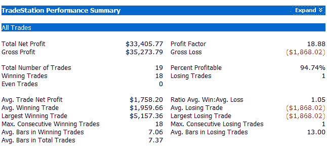

<!--yml
category: 未分类
date: 2024-05-18 13:36:52
-->

# Quantifiable Edges: CBI Finally Spikes

> 来源：[http://quantifiableedges.blogspot.com/2008/10/cbi-finally-spikes.html#0001-01-01](http://quantifiableedges.blogspot.com/2008/10/cbi-finally-spikes.html#0001-01-01)

The CBI (Capitulative Breadth Indicator) finally spiked above 10 today and hit 12\. For those who are unfamiliar with my CBI indicator, it basically uses a proprietary calculation to determine how much capitulation is evident among large-cap stocks. Spikes of 10 or higher in the past have led to market bounces on a fairly consistent basis. Those who would like more info on the CBI may want to read

[the intro post here](http://quantifiableedges.blogspot.com/2008/01/my-capitulative-breadth-indicator.html)

or the full post history

[here](http://quantifiableedges.blogspot.com/search/label/CBI)

. Until Tuesday the CBI had sat relatively dormant. I had thought the market might rebound before the CBI ever hit 10 this time, but this market seems bent on marking every extreme.

Until July, buying the S&P any time the CBI hit 10 or higher and selling it on a return to 3 or lower had a perfect record. The July trade turned out to be a loser. Below are statistics going back to 1995, which is as far as I was able to accurately reconstruct the indicator. The CBI has been tracked live for about 3 years now. All trades assume $100,000 into the S&P 500.

Impressive stats, but it’s important to keep in mind that the current environment is unlike anything we’ve seen since before data exists on this indicator.