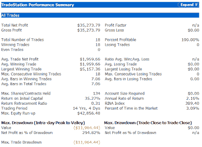

<!--yml
category: 未分类
date: 2024-05-18 08:13:17
-->

# Quantifiable Edges: CBI Hits 10 - Some Hypothetical Results

> 来源：[http://quantifiableedges.blogspot.com/2008/07/cbi-hits-10-some-hypothetical-results.html#0001-01-01](http://quantifiableedges.blogspot.com/2008/07/cbi-hits-10-some-hypothetical-results.html#0001-01-01)

The

[Capitulative Breadth Indicator (CBI)](http://quantifiableedges.blogspot.com/search/label/CBI)

closed at “10” on Tuesday (July 1st). Historically, this has been a reliable indication that the market is nearing a bounce. Using backtested data from 1995-2005 and live data from 2005 forward, there have been 18 instances when the CBI reached at least 10\. Buying the S&P when it hit 10 and selling on a return to 3 or lower would have been profitable all 18 times. Below are some summary statistics ($100,000 per trade):

The max drawdown is important to keep in mind. A CBI of 10 is not magic. It doesn’t guarantee anything. It’s indicating that downside breadth is overdone. This shouldn’t be a revelation. Last week I showed another breadth indicator that was also overdone. It still is. Hopefully the market does what breadth says it’s supposed to do soon.