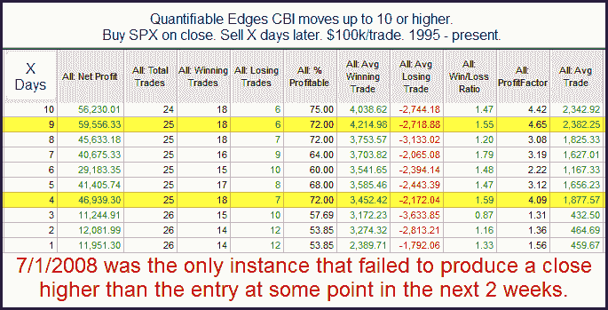

<!--yml
category: 未分类
date: 2024-05-18 12:57:41
-->

# Quantifiable Edges: CBI Hits 14 Suggesting A Bounce

> 来源：[http://quantifiableedges.blogspot.com/2010/06/cbi-hits-14-suggesting-bounce.html#0001-01-01](http://quantifiableedges.blogspot.com/2010/06/cbi-hits-14-suggesting-bounce.html#0001-01-01)

One notable breadth indication that hit an extreme Tuesday is the CBI, which jumped up to 14\. I alerted followers of this

[via Twitter](http://twitter.com/qerob)

near the close. As I’ve written about and discussed many times in the past, moves to 10 or above have typically been suggestive of a strong bounce within a few days. Below is a simple test that shows results of buying a move up to 10 or higher and then exiting X days later.

More information on the CBI may be found using the CBI label below. Also, I recently updated the Catapult and CBI presentation in the members section of the website. If you would like to see the presentation or see the trade triggers that have pushed the CBI up to 14, you may take

[a free trial](http://www.quantifiableedges.com/members/register.php)

. (If you are already in the system but haven't trialed yet in 2010, just drop me a note and I'll set you up with one.)