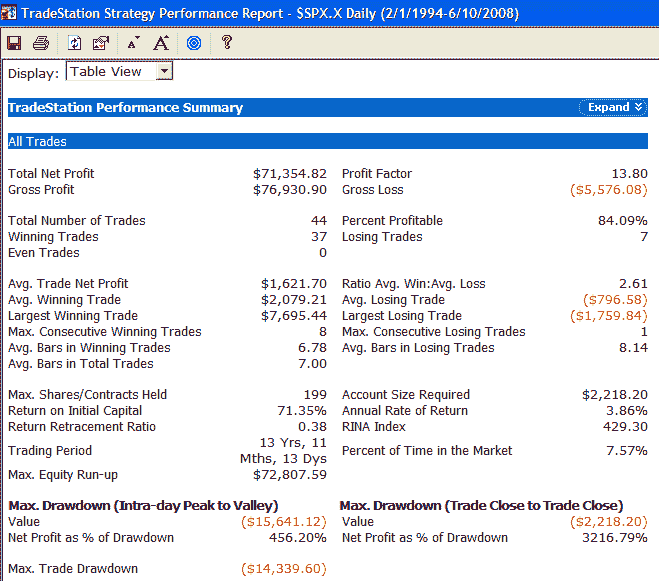

<!--yml
category: 未分类
date: 2024-05-18 08:15:06
-->

# Quantifiable Edges: CBI Hits 7 - Some Hypothetical Results

> 来源：[http://quantifiableedges.blogspot.com/2008/06/cbi-hits-7-some-hypothetical-results.html#0001-01-01](http://quantifiableedges.blogspot.com/2008/06/cbi-hits-7-some-hypothetical-results.html#0001-01-01)

The

[Capitulative Breadth Indicator (CBI)](http://quantifiableedges.blogspot.com/search/label/CBI)

edged up to “7” today. As I’ve discussed many time in the past, this is a level where I typically begin to take on long index exposure. Below is a strategy report of the standard entry/exit technique I’ve discussed before of buying the S&P 500 when it hits “7” or higher and then exiting on a drop to “3” or lower. Under normal circumstances a bounce would likely arrive in the next few days. The question is whether this is one of those times where things are a little different and become a lot scarier – like August of 1998, September of 2001 or July of 2002\. In cases like those you’d prefer not to get “all in” too soon.

All hypothetical trades in the below report were done with $100,000.

