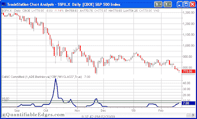
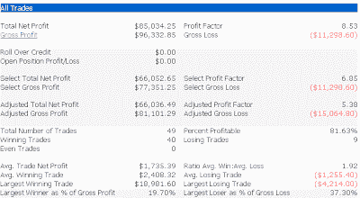

<!--yml
category: 未分类
date: 2024-05-18 13:27:17
-->

# Quantifiable Edges: CBI Hits 7 For 1st Time Since November

> 来源：[http://quantifiableedges.blogspot.com/2009/02/cbi-hits-7-for-1st-time-since-november.html#0001-01-01](http://quantifiableedges.blogspot.com/2009/02/cbi-hits-7-for-1st-time-since-november.html#0001-01-01)

I haven’t mentioned the Capitualtive Breadth Indicator (CBI) for a while. For those unfamiliar it is a proprietary method of measuring the amount of capitulation evident in the market. You may read

[the intro post here](http://quantifiableedges.blogspot.com/2008/01/my-capitulative-breadth-indicator.html)

or the

[entire series here](http://quantifiableedges.blogspot.com/search/label/CBI)

. Since the November lows it has been pretty much dormant except for a quick blip in January. It began to move up last week and at Friday’s close it hit 7\. Long-time readers will recall that this is a level where I feel a decent bullish edge exists. Below is a chart of the CBI from the Quantifiable Edges members section.

(click to enlarge)

In the past I’ve demonstrated that it can be used as a market timing tool for swing trades. One “system” I’ve shown here on the blog is to purchase the S&P 500 when the CBI hits a certain level (7 being one of them) and then sell the S&P when it returns back to 3 or below.

Below is an updated performance report of the above “system” covering 1995-present.

I'll keep readers informed of significant changes in the CBI over the next several days until it returns to neutral.