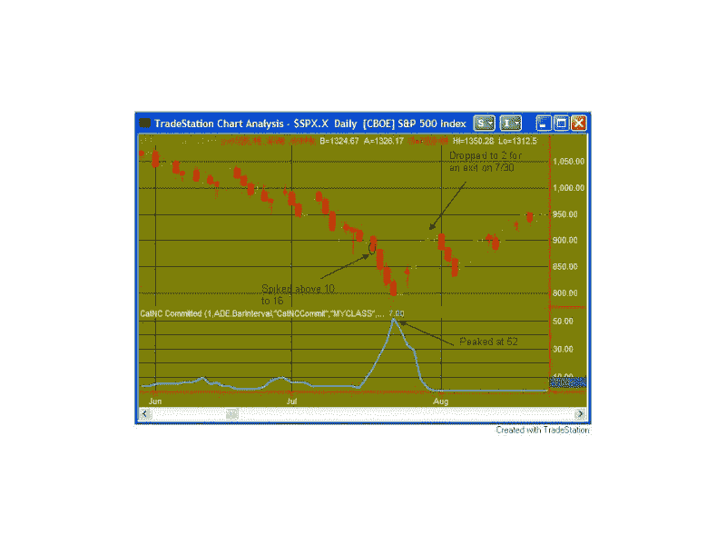
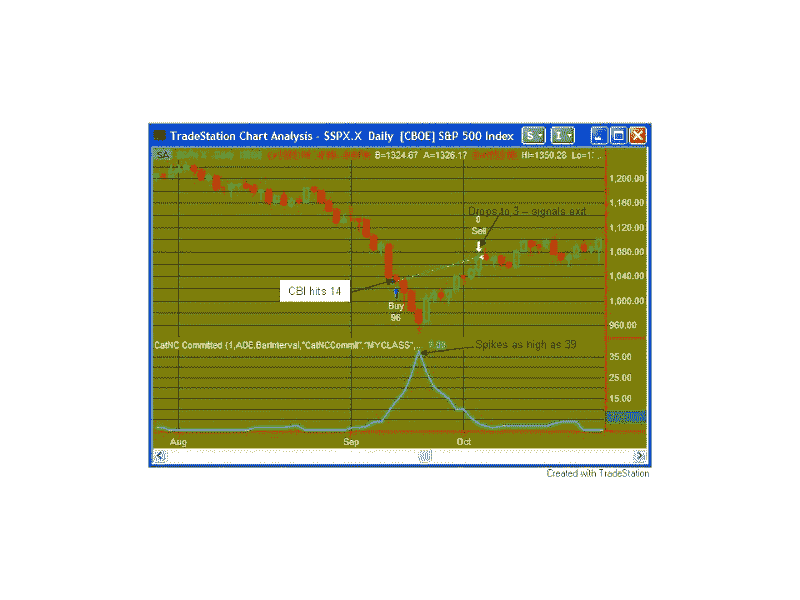

<!--yml
category: 未分类
date: 2024-05-18 08:36:30
-->

# Quantifiable Edges: CBI Spiking - How Bad Can It Get?

> 来源：[http://quantifiableedges.blogspot.com/2008/01/cbi-spiking-how-bad-can-it-get.html#0001-01-01](http://quantifiableedges.blogspot.com/2008/01/cbi-spiking-how-bad-can-it-get.html#0001-01-01)

The

[Capitulative Breadth Indicator](http://quantifiableedges.blogspot.com/2008/01/my-capitulative-breadth-indicator.html)

is on track to spike up from 5 on Friday to between 12 and 15 today. It has only spiked as high as 15 high 5 other times since 1995\. As I’ve stated in the past, spikes above 10 typically lead to a strong bounce. This does NOT preclude more downside before the bounce occurs, though.

Below are graphical displays of the two biggest spikes (and scariest declines) the indicator has seen. (It was backtested to 1995 and has been measured live since 2005.)

**July 2002**

In this case there were three more days of selling before the bottom and the bounce came. Going long at the close when it spiked above 10 would have led to a 12% intra-trade decline before posting a 2.4% gain.

**September 2001**

Here as well there were 3 more days of selling before the bottom was hit. This time the continued drop was about 8.5% from the entry to the low. The gain on the trade in this case was 3.8%.

**Summary**

The CBI is now signaling a sharp short-term reversal is near. As demonstrated above, there still could be a significant amount of short-term pain yet to endure. Spikes of 10 or higher have happened 16 times. Buying that close and selling on a return to 3 or lower has been profitable all 16 times. The average gain on the 16 occurrences from open to close was about 1.8%. The average intra-trade drawdown was about 3.1%. Starting relatively small and continuing to scale in as the market sinks is my preferred way to play it.

I will continue to update CBI readings in the days ahead.