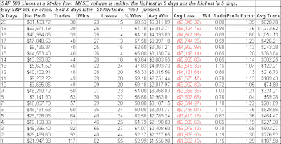
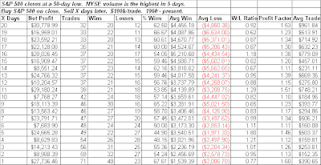
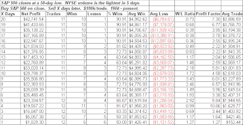

<!--yml
category: 未分类
date: 2024-05-18 13:26:17
-->

# Quantifiable Edges: Can The Market Bottom On Light Volume?

> 来源：[http://quantifiableedges.blogspot.com/2009/03/can-market-bottom-on-light-volume.html#0001-01-01](http://quantifiableedges.blogspot.com/2009/03/can-market-bottom-on-light-volume.html#0001-01-01)

One common misconception about steep selloffs is that they need to be accompanied by high volume in order to mark a bottom. October 10th and (to a lesser degree) November 20th, 2008 are two examples of big down days that came on big volume that soon led to a reversal. While this pattern can precede a bounce, you’d much rather see your new low accompanied by very low volume than very high volume.

Let’s look at some studies to illustrate this claim. First let’s look at performance following a 50-day low that has neither very high nor very low volume:

*{edit: the following tests were inadvertently run from 1992 - present, not 1960 - present.* [*See March 10th follow-up blog*](http://quantifiableedges.blogspot.com/2009/03/light-volume-bottoms-study-part-2.html) *for more details and longer-term results.}*

(click to enlarge)

So this is the base case and as you can see there is a slight upside edge over the next 1-20 days.

Now let’s look at the ever-popular high volume selloff:

(click to enlarge)

Results here are nearly indistinguishable from the base case. The high volume, while not a deterrent, does not seem to provide an additional edge.

Now let’s look at the less common case of a 50-day low occurring on light volume:

(click to enlarge)

While the number of instances is less than desired these results are clearly superior to the other scenarios. Over 90% winners after both 4 days and once you get out over 3 weeks. The average trade over the next week and over the next 4 weeks is about 4 times the size of the base case. While they didn’t all mark the exact low, some success stories included 10/7/02, 3/10/03, and 1/24/05.

There are plenty of technical reasons we should see a strong rebound soon. Thursday’s light volume can be added to the list. Now let’s just hope the market stops ignoring these reasons.