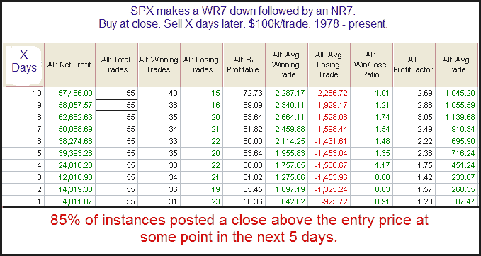

<!--yml
category: 未分类
date: 2024-05-18 13:12:50
-->

# Quantifiable Edges: Deceleration of Decline Suggests Bounce

> 来源：[http://quantifiableedges.blogspot.com/2009/10/deceleration-of-decline-suggests-bounce.html#0001-01-01](http://quantifiableedges.blogspot.com/2009/10/deceleration-of-decline-suggests-bounce.html#0001-01-01)

When there is a rapid deceleration in what was once a sharp selloff that often indicates a bounce is near. I’ve shown some examples of this concept over time. One way to look at deceleration would be by looking the size of the bars. Friday’s

[Quantifinder](http://quantifiableedges.blogspot.com/2009/05/quantifinder-unveiled.html)

found the following study from

[the 6/24/08 blog](http://quantifiableedges.blogspot.com/2008/06/selling-quiets-during-narrow-range-day.html)

. This study uses WR7 and NR7 days. A WR7 is a day whose range is the widest in the last 7 days. An NR7 is a day whose range is the narrowest in the last 7 days. All stats are updated.

This study suggests a decent upside edge over the next week-plus. One aspect of this study that I find particular appealing is that it has been consistent over time. Below is a profit curve using a 5-day exit strategy.

The consistent upward slope shown here is preferable to a jagged equity curve or one where most of the profits were made in a small number of trades.