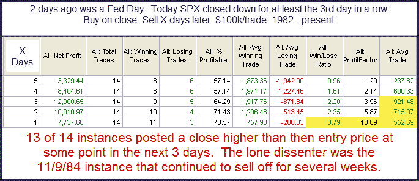

<!--yml
category: 未分类
date: 2024-05-18 12:53:51
-->

# Quantifiable Edges: Declines On & After Fed Days

> 来源：[http://quantifiableedges.blogspot.com/2010/09/declines-on-after-fed-days.html#0001-01-01](http://quantifiableedges.blogspot.com/2010/09/declines-on-after-fed-days.html#0001-01-01)

Historically Fed Days have generally had an upside bias. Often when the market closes down on a Fed Day it will bounce soon after. This week we have seen a down Fed Day (Tuesday) followed by 2 more days of selling. I looked at this situation in last night's subscriber letter.

While instances are low, there appears to be a decent upside edge. This is especially true on day 1\. I discussed some more details in the letter. Those that wish to take a free trial may do so at any time. Here is

[a link to the free trial](http://www.quantifiableedges.com/members/register.php)

. Those who are already registered but would like to do so again may simply send me an email. As long as it has been 6 months since your last trial, you are all set.