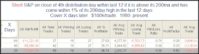
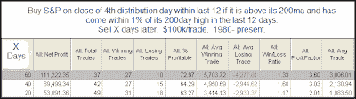
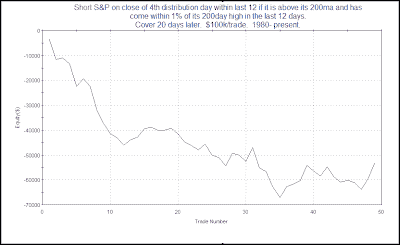

<!--yml
category: 未分类
date: 2024-05-18 13:15:26
-->

# Quantifiable Edges: Distribution Days Quantified

> 来源：[http://quantifiableedges.blogspot.com/2009/08/distribution-days-quantified.html#0001-01-01](http://quantifiableedges.blogspot.com/2009/08/distribution-days-quantified.html#0001-01-01)

*I'm out of action most of this week and unable to post much. Therefore I decided to take an excerpt from this past weekend's Subscriber Letter and post it to the blog:*

One sign of a potential top that some traders monitor is distribution days. It was popularized by Investors Business Daily. The essential idea is that when the market falls on increasing volume that suggests institutions are selling stock. When clusters of distribution days occur, it is a topping signal. Below are some quotes from

[an IBD column published on August 4th](http://www.investors.com/NewsAndAnalysis/Article.aspx?id=502420)

that discusses distribution.

*“What you're looking for is distribution. If one or more of the major indexes (the NYSE composite, the Nasdaq, the S&P 500 or Dow industrials) falls more than 0.2% in higher volume than in the prior session, that's a distribution day.

Distribution means the big money — mutual funds, investment banks and other institutional investors — is dumping shares. That's bad news for the little guy, because institutions make up roughly three-fourths of the market and chart its direction.

IBD studies show that when you get a series of three to five distribution days over a few weeks during an uptrend, that's a red flag.”

“Identifying distribution days is crucial: If you don't, you might have the wrong take on the market's direction. Then you'll be wrong about every move you make. That's a nice recipe for financial agony…Once distribution days pile up, it's wise to scale back your portfolio. Ease off margin, and get rid of any laggard stocks first. Raise cash and move entirely off stocks if necessary.”* 

So the bottom line is that if the market rallying, and you see a cluster of distribution days occur within a fairly short time period, you should begin selling stocks. The market is likely heading for a tumble. Let’s take a quantified look at it.

First, before I show test results I will say that clusters of distribution days do often occur near market tops – so they got that part right. But are they predictive of a top and should they be used for purposes of early identification?

I actually devised this test 4 years ago when I wrote an article for TradingMarkets about distribution days. To test the concept I looked for the following criteria:

1) The S&P closes above the 200-day moving average (remember – we’re looking for a top.)

2) Sometime within the last 12 days the S&P closed within 1% of its 200-day high. (Again, confirming we are near a top.)

3) Over the last 12 days there have been at least 4 distribution days.

Looking for 4 distribution days within 12 trading days was the criteria I used in the original test based on information at that time. It still seems like a good number according to the above article that suggests “a series of three to five distribution days over a few weeks during an uptrend, that's a red flag.”

So if you wanted to use this red flag as a short signal, how would you do looking out over the next 1, 2, and 3 month periods?

(click to enlarge)

Needless to say these results are horrible. It appears that following a bout of distribution is NOT a good time to be selling. What if we flip the study on its head and instead BUY after such instances when distribution day counters are unloading positions?

(click to enlarge)

Not the most explosive results I’ve ever posted in term of average trade, but a decent edge nonetheless. Wins are bigger than losses and the winning percentage is pretty good. This makes for decent looking profit factors (gross gains / gross losses = profit factor).

Is this a new phenomenon? Did distribution day counting formerly work and in recent years it has failed? That might explain why IBD has discussed it for so long. Sadly, no. Below is the equity curve for the 1st test above using a 20-day holding period.

While the results have been helped out by some horrible bear markets in the last decade, it’s never been a winning concept.

So why preach it? Well, it’s rare that you’ll get a top without a bout of distribution days. Therefore, when a top actually does occur, the service or person who talks about their importance can point to the top and say “See, the distribution days signaled it. You would’ve been fine if you’d just used this tool.”

This is somewhat similar to the perception that has been created with regards to follow through days for calling market bottoms. They occur there, but they are not predictive and are pretty much a worthless tool. For detail on follow through days, you may refer to

[the series I wrote last year](http://quantifiableedges.blogspot.com/2008/07/follow-through-days-quantified.html)

. The primary difference here is that while follow through days are generally worthless, counting distribution days to try and identify tops is worse than that – it’s hazardous.

The bottom line reality of distribution days is that when the market endures a pullback after an extended uptrend, it’s often a buying opportunity and NOT a time to sell.

Of course there are still reasons to be cautious here, but of the things I am seeing that are of concern, distribution days are at the bottom of the list.

*Since I’m out of action most of this week and I’m sure this post will be viewed as controversial in the eyes of some, I’ve decided to give away the code. Rather than debate or re-run the tests different ways (I’ve already done that myself), Tradestation users may feel free to download the code themselves from* [*the free download page on the website*](http://www.quantifiableedges.com/members/freedownload.php)*. Login is required. Sign-up is free and only requires a name and email address.*