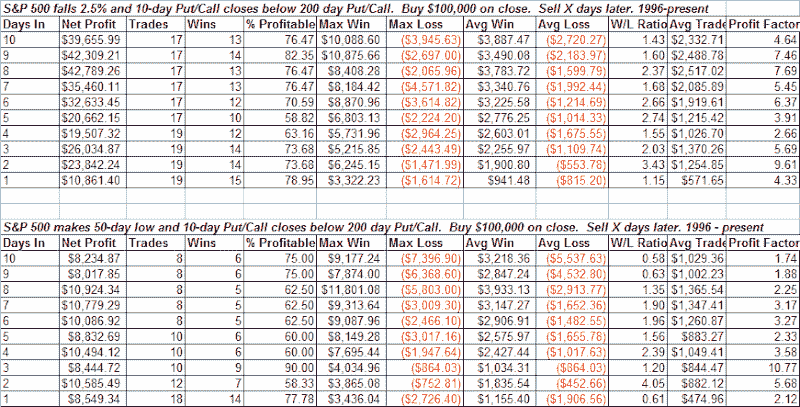

<!--yml
category: 未分类
date: 2024-05-18 08:13:40
-->

# Quantifiable Edges: Does A Lackadaisical Put/Call Keep The Market From Bouncing?

> 来源：[http://quantifiableedges.blogspot.com/2008/06/does-lackadaisical-putcall-keep-market.html#0001-01-01](http://quantifiableedges.blogspot.com/2008/06/does-lackadaisical-putcall-keep-market.html#0001-01-01)

One measure of sentiment that is notably underwhelming is the CBOE Put/Call ratio. This is a concern for some traders. As of today the 10-day put/call was 101.3\. This is actually lower than the 200-day moving average of 101.7\. Below are two studies that show what has happened when negative price action has been accompanied by a lackadaisical put/call:

This first one I looked at both above and below the 200-day moving average, and it made little difference. The implication of the Put/Call tests seems to be that a relatively low Put/Call doesn’t hurt the chance of a nice bounce. This was a bit surprising. Also a bit encouraging.