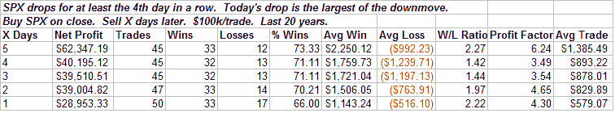
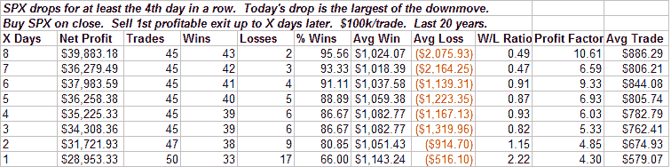
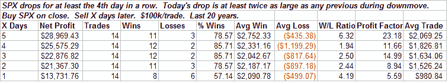
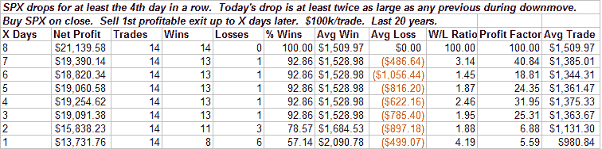

<!--yml
category: 未分类
date: 2024-05-18 13:39:24
-->

# Quantifiable Edges: Downside Acceleration Frequently Precedes Reflex Rallies

> 来源：[http://quantifiableedges.blogspot.com/2008/09/downside-acceleration-frequently.html#0001-01-01](http://quantifiableedges.blogspot.com/2008/09/downside-acceleration-frequently.html#0001-01-01)

When a move that is already becoming extended rapidly accelerates it frequently means a countermove is about to begin.

[I discussed this concept in April](http://quantifiableedges.blogspot.com/2008/04/intraday-extremes.html)

in the context of an intraday timeframe. Tonight I will finally show its historical effectiveness using daily bars.

After trading lower for three days in a row, the S&P 500 (and most everything else) completely collapsed today, finishing down about 3%. Below is a study that shows the short-term statistics following similar setups:

The edge erodes after the 1st week. It’s basically a short-term setup. To give some perspective on how often any kind of bounce above the entry occurred I ran a 2nd study that looked to exit any time the trade closed profitable.

Pretty impressive reliability. Here we see 81% winners within the next 2 days, 89% within a week and 96% within 8 trading days.

Today’s drop was not only the biggest of the move down, it was over twice the size of the next biggest drop (last Friday). Generally, the more extreme the drop in comparison to the other days, the better the results. Below are the stats associated with a 2x drop similar to today:

Better winning percentage, higher average wins and lower average losses make for better overall stats. I also ran the “1st profitable exit” strategy here:

Thirteen of fourteen were positive within 3 days. By day 8, all fourteen instances were positive.

This all suggests a reflex move higher is likely in the next few days.