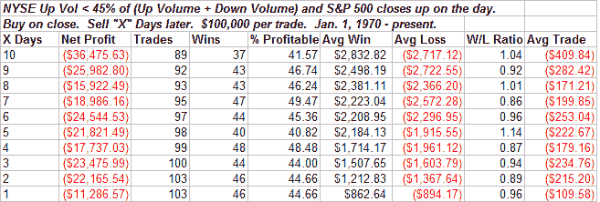

<!--yml
category: 未分类
date: 2024-05-18 08:15:13
-->

# Quantifiable Edges: Draggin' Breadth

> 来源：[http://quantifiableedges.blogspot.com/2008/06/draggin-breadth.html#0001-01-01](http://quantifiableedges.blogspot.com/2008/06/draggin-breadth.html#0001-01-01)

Looking at the price changes in the major indices it might appear that Monday was a quiet day with little out of the ordinary. In fact, the higher closes in the S&P 500 and Dow masked some substantial selling that took place. Breadth was strongly negative on the NYSE, both in terms of advancers vs. decliners and in terms of up volume vs. down volume.

In fact up volume was nearly doubled by down volume. It made up less that 35% of the total of the two. I looked back to 1970 to see other times when up volume was less than 35% of up plus down volume while the S&P 500 closed positive on the day. I was fairly surprised to find only 4 other cases. They were 3/27/80, 1/25/82, 10/4/94, and 3/23/05.

To see what poor breadth on an up day may suggest I then loosened the requirements some. In this case I changed the requirement from 35% up volume to 45% or lower up volume. Below is a summary of the results.

It appears that the weakness in the broad market tends to act as a drag on the S&P over the subsequent two weeks. Whatever was holding the S&P 500 up in the face of the instance-day weakness eventually ends up falling as well.

On another note, the

[CBI](http://quantifiableedges.blogspot.com/search/label/CBI)

moved up to “6” today. Any higher and we’ll be at levels where I

*normally*

being scaling into long index positions.