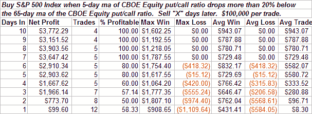

<!--yml
category: 未分类
date: 2024-05-18 08:18:22
-->

# Quantifiable Edges: Equity Put/Call Ratio Spikes Down

> 来源：[http://quantifiableedges.blogspot.com/2008/05/equity-putcall-ratio-spikes-down.html#0001-01-01](http://quantifiableedges.blogspot.com/2008/05/equity-putcall-ratio-spikes-down.html#0001-01-01)

Dr. Brett Steenbarger over at Traderfeed has done

[some excellent work with put/call ratios](http://traderfeed.blogspot.com/search?q=put%2Fcall)

over the last few years. One way he measures it is by comparing a short-term moving average of put/call volume to a long-term put/call moving average. He has demonstrated numerous times how spikes in the short-term averages over the long-term averages tend occur near market bottoms.

The options market is now experiencing a spike down, rather than a spike up, in the put/call ratio. An example of this could be seen by considering the 5 and 65 day moving averages of the CBOE Equity put/call ratio (two averages that Dr. Steenbarger sometimes uses). As of tonight’s close the 5-day stood at 0.62 and the 65-day at 0.80\. This is over a 20% gap from the 65 to the 5.

If spikes up in the put/call can predict a bottom, could a spike down predict a top?

Not based on the limited data available. The equity put/call data has only been tracked back to 2003\. Below are the results:

The dates for the 4 instances were 11/10/04, 12/16/04, 5/24/05, and 7/14/05\. Basically it happened at times where the market rallied strongly following a pullback or correction. I suspect the sharp drop in the average put/call ratio represents a shift in attitude of market participants. Coming out of a corrective period it appears this buying enthusiasm is a good thing and not representative of complacency.

I also ran the same test using the Total Volume Put/Call Ratio back to 1996\. Results there leaned to the bullish side as well with between 57% and 67% of cases showing continued gains over the next 2-3 weeks.

The low put/call ratios may become an issue if they remain low for an extended period. I’d be careful of trying to call a top based on any spikes lower in the ratio, though. Spikes may represent enthusiasm rather than complacency. Now if we could just get some volume we could really make a case for enthusiasm.