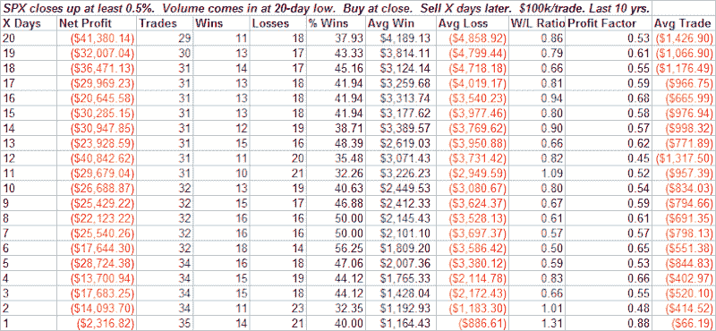

<!--yml
category: 未分类
date: 2024-05-18 13:41:19
-->

# Quantifiable Edges: Exceptionally Low Volume Casts Shadow

> 来源：[http://quantifiableedges.blogspot.com/2008/08/exceptionally-low-volume-casts-shadow.html#0001-01-01](http://quantifiableedges.blogspot.com/2008/08/exceptionally-low-volume-casts-shadow.html#0001-01-01)

The market bounced on Thursday, but volume was anemic. On the NYSE it was the lowest volume since the July 3rd holiday-shortened session. When the market moves up, you’d normally rather see it occur on strong volume. Exceptionally weak volume, like we saw today, has been followed by some difficult market conditions over the last 10 years. Some statistics below:

One additional thought on volume for the back half of August. Over the next two weeks it is probable that volume will drop off due to traders taking vacations. When monitoring volume, shorter-term comparisons may need to be made to gain value from the information. For example, rather than comparing volume to its 50-day average, you may get a truer indication by comparing it to the last 1-3 days.