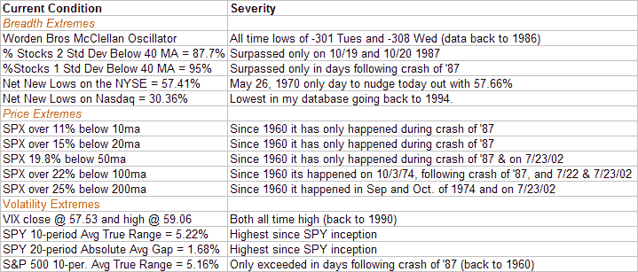

<!--yml
category: 未分类
date: 2024-05-18 13:36:44
-->

# Quantifiable Edges: Extreme Conditions

> 来源：[http://quantifiableedges.blogspot.com/2008/10/extreme-conditions.html#0001-01-01](http://quantifiableedges.blogspot.com/2008/10/extreme-conditions.html#0001-01-01)

The market is hitting massive extremes with regards to breadth, price, and volatility. Below is an incomplete list that illustrates just how severe current conditions are:

Take just about any of the conditions above, slice it in half, and under “normal” circumstances it would be extreme enough for a bounce a high percentage of the time.

Note: The top 3 breadth statistics come from Worden Bros. - T2106, T2114, & T2116.