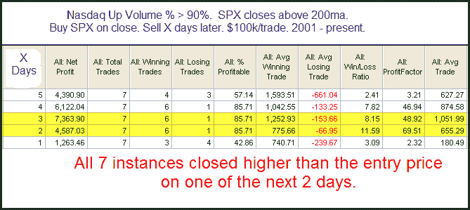

<!--yml
category: 未分类
date: 2024-05-18 13:10:26
-->

# Quantifiable Edges: Extreme Nasdaq Breadth Suggests Higher Prices

> 来源：[http://quantifiableedges.blogspot.com/2009/11/extreme-nasdaq-breadth-suggests-higher.html#0001-01-01](http://quantifiableedges.blogspot.com/2009/11/extreme-nasdaq-breadth-suggests-higher.html#0001-01-01)

While most everything did well on Thursday, much of the excitement was directed towards smallcaps and Nasdaq stocks. Below is a little study that shows how the market has performed in the past following such buying interest in the Nasdaq while the S&P 500 was in a long-term uptrend.

Instances are lower than I’d typically like to see, but with all 7 closing higher in the next day or 2, this study appears worth noting. Extremely strong volume breadth going into riskier Nasdaq stocks has often led to some follow through when the market is in a long-term uptrend.

Of course the jobs report may have a little something to say about today's action as well...