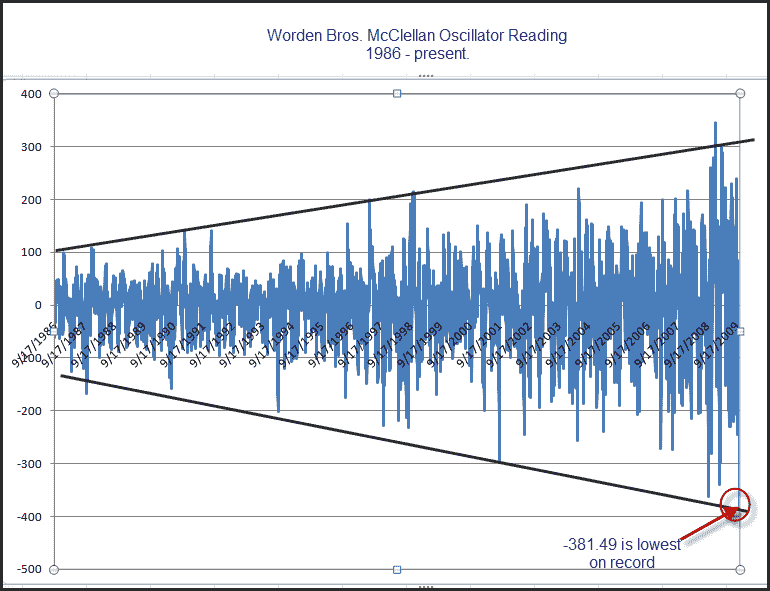

<!--yml
category: 未分类
date: 2024-05-18 13:10:56
-->

# Quantifiable Edges: Extreme Weakness Never Before Seen By This Measure

> 来源：[http://quantifiableedges.blogspot.com/2009/10/extreme-weakness-never-before-seen-by.html#0001-01-01](http://quantifiableedges.blogspot.com/2009/10/extreme-weakness-never-before-seen-by.html#0001-01-01)

The McClellan Oscillator uses advance/decline data to calculate the strength or weakness of a move from a breadth standpoint. The value will vary from provider to provider as there are often slight differences in advance/decline data. Worden Bros. is one data provider I use. Their measure of the McClellan Oscillator hit -381.49 on Wednesday. This is the lowest reading since they began tracking advance/decline data in 1986\. (Others I look at are low but not quite all-time lows.) Below is a chart of the McClellan Oscillator over the entire data period.

One notable about this chart is that breadth readings have become more extreme over time. Whereas moves above 100 and below -100 were rare from ’86 – ’93, they are fairly ordinary today.

For more information on the McClellan Oscillator you may visit the link below: