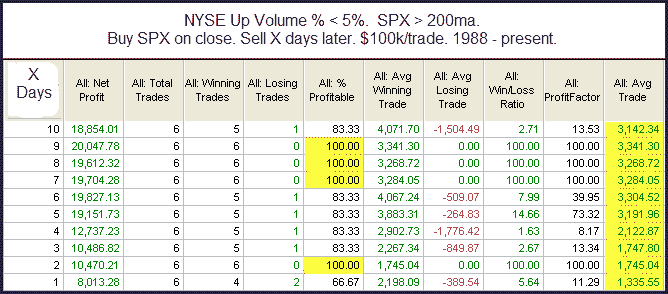

<!--yml
category: 未分类
date: 2024-05-18 13:05:19
-->

# Quantifiable Edges: Extremely Negative Breadth Days In A Long-Term Uptrend

> 来源：[http://quantifiableedges.blogspot.com/2010/02/extremely-negative-breadth-days-in-long.html#0001-01-01](http://quantifiableedges.blogspot.com/2010/02/extremely-negative-breadth-days-in-long.html#0001-01-01)

I looked at yesterday’s selloff a number of different ways last night. The overriding theme suggested this selloff is already getting overdone. Below is one example of a study I ran.

Instances are low, but with 100% winners on days 2, 7, 8, and 9 as well as very strong average trade results over the period I felt it was worth considering.