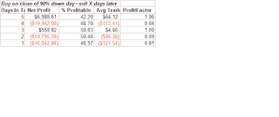
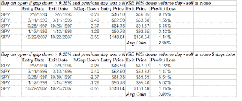

<!--yml
category: 未分类
date: 2024-05-18 08:37:05
-->

# Quantifiable Edges: Extremely weak breadth and a possible gap lower...

> 来源：[http://quantifiableedges.blogspot.com/2008/01/extremely-weak-breadth-and-possible-gap.html#0001-01-01](http://quantifiableedges.blogspot.com/2008/01/extremely-weak-breadth-and-possible-gap.html#0001-01-01)

The IBD Follow Through Day study seems to be generating a lot of interest, and I promise I will get back to it shortly. The market looks to be setting up for some interesting trading tomorrow morning, though – so I thought I’d focus on more pressing issues.

NYSE down volume swamped up volume by over 9:1 today. That kind of breadth is somewhat unusual and can be a sign of panic. Lowry’s was the first group I’m aware of to do extensive study on “90% days” and they have

[some excellent material on them.](http://www.lowryresearch.com/research_studies.cfm)

Intel disappointed after the close and has added fuel to the fire.. As I write this around midnight Dow futures are down 100 points, S&P 500 futures are down 12 points and Nasdaq futures are down a whopping 32 points. Asian markets are also taking it on the chin.

Let’s take a look at history to see how the next few days may be setting up. Going back to 1970, there were one hundred and thrity-two 90% downside days identified by my database. When viewing 90% down days in isolation, this is how the next week looked:

As you can see - by itself a 90% down volume day is not a clear sign of a washout. There is more downside to come more often than not.

The next table looks back to early 1993 – the inception of the SPY. Since then there have been thirty-six 90% down volume days on the NYSE. Of those 36, only 5 times has the SPY gapped lower the next morning by more than 0.25%. With a gap lower looking likely, I thought it might be worth taking a look at those occurrences:

The 90% downside day on its own won’t necessarily wash out the market, but when combined with gap down open it typically has served to mark at least a short-term panic low. Although the sample size for this study is smaller than I typically like, should the gap down occur, the consistent and sizable gains in the study above indicate that traders should be aware of a potentially large intraday reversal.

Rob Hanna