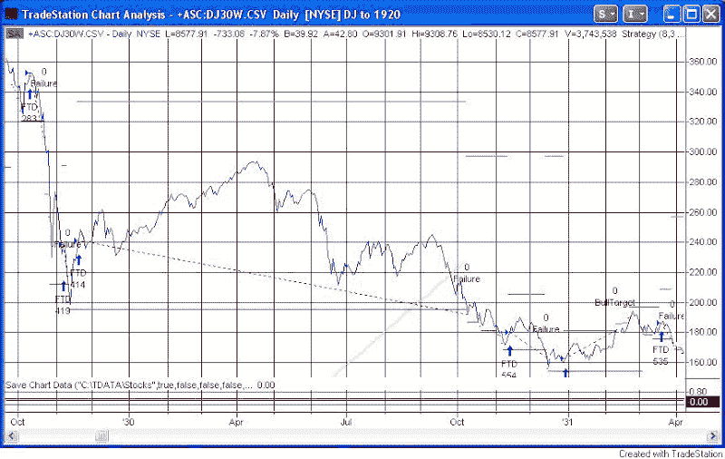
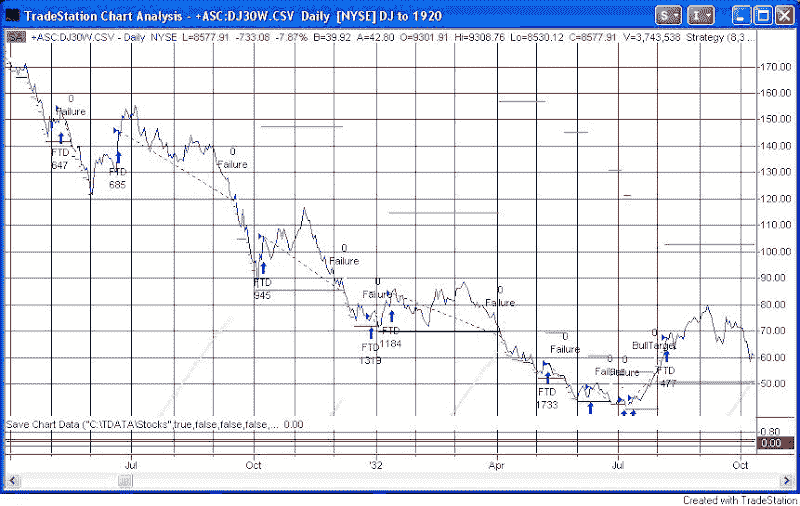

<!--yml
category: 未分类
date: 2024-05-18 13:32:11
-->

# Quantifiable Edges: FTD's After the Crash of 1929

> 来源：[http://quantifiableedges.blogspot.com/2008/12/ftds-after-crash-of-1929.html#0001-01-01](http://quantifiableedges.blogspot.com/2008/12/ftds-after-crash-of-1929.html#0001-01-01)

The market posted a Follow Through Day again last week. This is at least the 6th Follow-Through Day since the 2007 top. New blog readers may want to check out the

[series of studies I’ve written on Follow-Through Days (FTD’s)](http://quantifiableedges.blogspot.com/search/label/IBD%20Follow%20Through%20Day)

to gauge their usefulness.

There are some issues a trader would have if they used a FTD as a market buy signal. (This is not the recommended use by IBD, but does help to determine the predictive power of FTD’s when conducting studies.) One issue is that they tend to commonly fail during difficult bear markets.

Several weeks ago in the Subscriber Letter I posted a study which looked at FTD effectiveness following the Crash of ’29\. (This study only looked at the Dow.) Below is an excerpt from that Letter:

*I thought it would be interesting to see how FTD’s performed following the 1929 crash. As a brief reminder, “success” for a FTD would entail either 1) The market making a new high or 2) a rally from the close of the FTD that equals at least twice the distance from the low to the FTD. Below are charts spanning the period from 1929 to in 1932.* *In this chart we see several failures and one FTD that led to a rally meeting its target. While it didn’t meet the definition of success, the rally in the early part of 1930 was actually the best over the time period.

Next is ’31 – ’32:* **Plenty more failures are seen here before the market finally bottoms in mid-1932\. All told there were 13 failed FTD’s and one successful one before the 1932 bottom arrived.* 

A FTD is a positive sign when looking for a potential market bottom and subsequent rally. The current rally attempt may succeed. The market certainly seems overdue for a substantial and sustained rally. FTD and other bottoming signals have proven far less reliable over the last year. There have been a few other times where they have struggled as well. The period above is one example. Just something for the back of the mind as the current rally attempt unfolds.

------------------------------------------------------------------------------------

Anyone who would like to purchase the FTD code for their own testing may do so [here](http://www.quantifiableedges.com/studies.html).

**A note to blog readers:** I will be out of action most of this week. There may not be any other posts until next week. Fear not. I shall return to the blogosphere next week with a vengeance. – Rob

****A note to Gold & Silver Subscribers:** I completed implementation of a new distribution system. I believe everything is working fine. If you did not receive tonight's Letter, please contact me ASAP.***