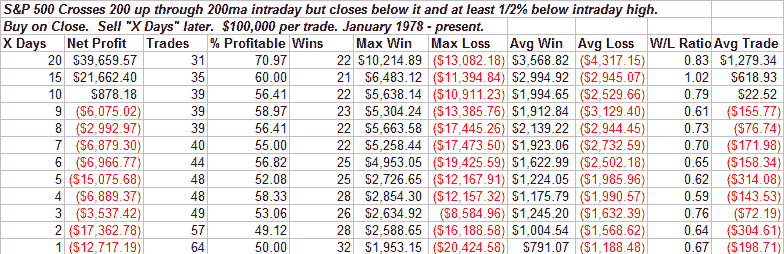
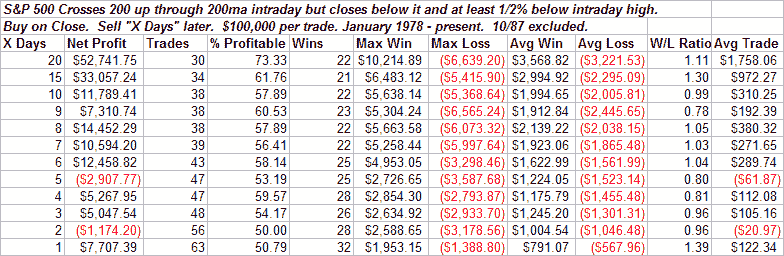
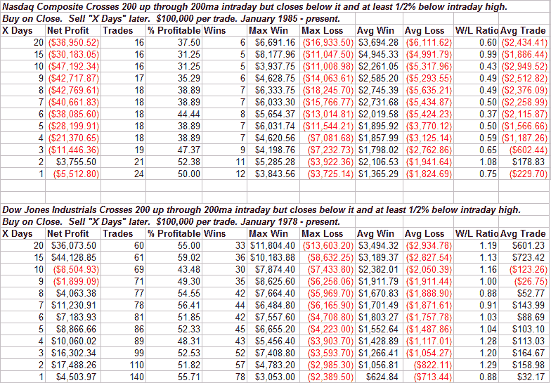

<!--yml
category: 未分类
date: 2024-05-18 08:17:14
-->

# Quantifiable Edges: Failure To Launch

> 来源：[http://quantifiableedges.blogspot.com/2008/05/failure-to-launch.html#0001-01-01](http://quantifiableedges.blogspot.com/2008/05/failure-to-launch.html#0001-01-01)

About 2 ½ weeks ago the Nasdaq 100 blasted through it 200-day moving average.

[Tests I ran at that time](http://quantifiableedges.blogspot.com/2008/05/200ma-cross.html)

suggested an edge over the 1-4 weeks following such activity. So far so good for the NDX. Today the S&P 500 tried to smash through the 200-day moving average. After a strong morning it turned tail and dropped fairly hard in the afternoon. In doing so it failed to close above the 200\. Tonight I looked at possible implications of intraday spikes above the 200ma that fail.

This first test looks quite negative for the 1st week and then positive over the following three weeks. Note the Max Loss column, though. This one triggered the night before the Crash of ’87\. This is the biggest possible outlier you could have over the time period tested. To see results more representative of typical, I excluded that trade.

It is always important to look at outliers. A massive outlier like the crash of ’87 could dramatically change the results. Now the results don’t look so bad initially. There is still some downward chop in the first week, though, followed by a nice rise in prices.

To better asses the possible influence of the criteria on performance I then looked at how the Dow and Nasdaq performed under similar circumstances.

The Nasdaq never got it together following the “Failure to Launch” through the 200\. The Dow results were choppy and uneven. Four weeks out they were positive but less so than a random sample over the test period.

The way I see it, a failure of the 200 like we saw today appears to lead to weakness in the short-term. The one consistent of the tests is that they all showed a negative expectancy shortly after the event. Longer-term whether the market gets it together like the S&P results suggest or continues to struggle as the Nasdaq results suggest is unclear. Keep in mind that beyond the short-term there are much bigger forces at work than today’s action. I therefore wouldn’t try and extrapolate out too far with this test.

The short-term negative does jive with some of my other work and I continue to believe a pullback is likely in the next few days.