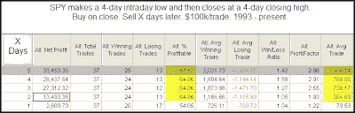

<!--yml
category: 未分类
date: 2024-05-18 13:14:57
-->

# Quantifiable Edges: False Breakdown Often Leads to Move Higher

> 来源：[http://quantifiableedges.blogspot.com/2009/08/false-breakdown-often-leads-to-move.html#0001-01-01](http://quantifiableedges.blogspot.com/2009/08/false-breakdown-often-leads-to-move.html#0001-01-01)

The fact that the market tried to break down from its recent range Thursday and then reversed to close at a new high could be interpreted as bullish. Below is a test that describes Thursday’s action:

(click table to enlarge)

Pretty solid results across the board suggest an upside breakout appears more likely than a pullback at this point.