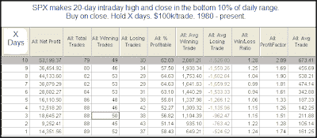
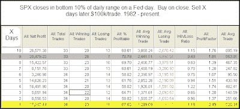

<!--yml
category: 未分类
date: 2024-05-18 13:13:23
-->

# Quantifiable Edges: Fed Day Selloffs

> 来源：[http://quantifiableedges.blogspot.com/2009/09/fed-day-selloffs.html#0001-01-01](http://quantifiableedges.blogspot.com/2009/09/fed-day-selloffs.html#0001-01-01)

Wednesday’s Fed day reversal acted much like the one that appeared on April 30, 2008\. The May 1, 2008 blog featured a couple of studies that were relevant again today. They were just some of what

[the Quantifinder](http://quantifiableedges.blogspot.com/2009/05/quantifinder-unveiled.html)

identified as relevant last night. I re-ran those studies below. This 1st one looks at times the SPX made a 20-day high and then closed in the bottom 10% of its daily range.

(click table to enlarge)

There appears to be an upside edge here. Although it isn’t the most powerful edge we’ve seen it still appears to suggest bullish inclinations over the next few days and weeks.

Also in that May 1, 2008 blog I looked specifically at Fed days that closed in the bottom 10% of their daily range. I re-ran that study as well tonight.

(click table to enlarge)

Much of the edge here appears in the first day. Poor closes on Fed days have rarely seen significant follow through in the coming days. More often the selling is viewed as an overreaction and the market is able to rebound a bit.

It appears Wednesday's action suggests bullish implications over the short-term.

If you’d like to trial Quantifiable Edges premium services including

[the Quantifinder](http://quantifiableedges.blogspot.com/2009/05/quantifinder-unveiled.html)

and the Subscriber Letter you may sign up for

[a free trial here](http://www.quantifiableedges.com/members/register.php)

. (Those that have trialed before but not since the Quantifnder was released in June may email support @ quantifiableedges.com (no spaces) and I’ll be happy to set you up with a new trial.)