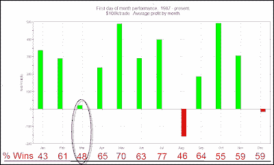

<!--yml
category: 未分类
date: 2024-05-18 13:04:02
-->

# Quantifiable Edges: First Day of March Is Weak Compared To Most 1st Days

> 来源：[http://quantifiableedges.blogspot.com/2010/03/first-day-of-march-is-weak-compared-to.html#0001-01-01](http://quantifiableedges.blogspot.com/2010/03/first-day-of-march-is-weak-compared-to.html#0001-01-01)

A quick reminder rather than a new study this morning…

Typically we see the 1st day of the month provide a bit of a bullish tendency. This tendency really began to take hold in the late 80’s when 401k plans started to become more popular and regular stock inflows began to occur at the beginning of the month. Last July I broke this edge out by month. Below is a copy of that chart (not updated).

(click chart to enlarge)

I’ve circled the March stats. You can see that over the last 23 years March has been the 3rd worst both in terms of “% profitable” and in terms of “net profits”. There have been 11 winners and 12 losers and the total profits have been right in line with long term drift. So while April – July show a bit of an upside edge at the beginning of the month, March hasn’t had the same past results.