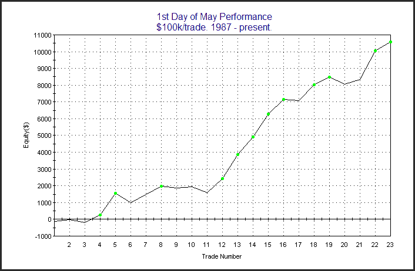

<!--yml
category: 未分类
date: 2024-05-18 13:00:56
-->

# Quantifiable Edges: First Trading Day of May Has Been Seasonally Bullish

> 来源：[http://quantifiableedges.blogspot.com/2010/05/first-trading-day-of-may-has-been.html#0001-01-01](http://quantifiableedges.blogspot.com/2010/05/first-trading-day-of-may-has-been.html#0001-01-01)

Monday is the 1st trading day of May. I’ve discussed many times before how the 1st trading day of the month tends to be seasonally bullish.

[Last July I showed a chart](http://quantifiableedges.blogspot.com/2009/07/1st-day-of-month-tendencies.html)

breaking it down by month. May has been one of the strongest months, both based on total return and % profitable. Below is a graph showing performance on the 1st day of May since 1987.

Also notable is that 22 of the last 23 years the SPX has closed above the final April close on either the 1st or 2nd day of May. The lone exception was 1989, which lost a total of 0.5% over the 2 days.