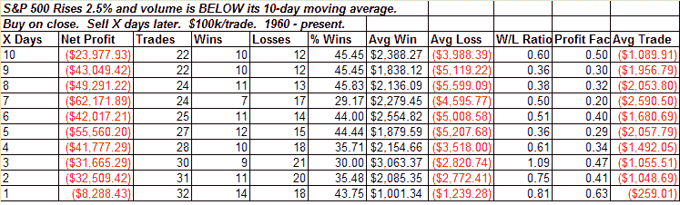

<!--yml
category: 未分类
date: 2024-05-18 13:34:08
-->

# Quantifiable Edges: Friday Was Another Low Volume Rally

> 来源：[http://quantifiableedges.blogspot.com/2008/11/friday-was-another-low-volume-rally.html#0001-01-01](http://quantifiableedges.blogspot.com/2008/11/friday-was-another-low-volume-rally.html#0001-01-01)

The market rallied nicely on Friday but volume came in quite a bit below the previous few days. Strong up days on low volume have been creamed lately. A few recent examples would include 9/30, 10/13, 10/20, and 11/4\. The table below shows results following all one-day gains of 2.5% or more that were accompanied by volume under the 10-day average.

Much more on this study was published in last night's

[Subscriber Letter](http://www.quantifiableedges.com/letter.html)

. If you haven't yet trialed it then simply email

[QuantEdges@HannaCapital.com](mailto:QuantEdges@HannaCapital.com)

with your name and email address an I'll send you last night's Letter along with 3 upcoming ones.