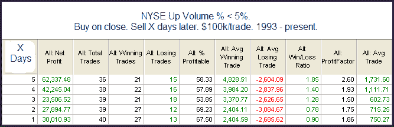

<!--yml
category: 未分类
date: 2024-05-18 13:09:30
-->

# Quantifiable Edges: Friday's Breadth Was SO Negative...It Could Be Positive

> 来源：[http://quantifiableedges.blogspot.com/2009/11/fridays-breadth-was-so-negativeit-could.html#0001-01-01](http://quantifiableedges.blogspot.com/2009/11/fridays-breadth-was-so-negativeit-could.html#0001-01-01)

Friday’s selloff was marked by extremely negative breadth. Around 97% of the volume was to the downside on the NYSE. In the past, days that have been SO negative have often led to bounces over the short-term. This can be seen in the study below.

The “% Profitable” is positive but not overwhelming. Risk/reward is pretty solidly bullish, though with the"Avg Trade" showing some strong numbers.