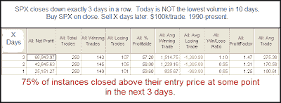
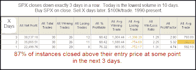

<!--yml
category: 未分类
date: 2024-05-18 13:13:14
-->

# Quantifiable Edges: Friday's Very Low Volume Provides An Upside Edge

> 来源：[http://quantifiableedges.blogspot.com/2009/09/fridays-very-low-volume-provides-upside.html#0001-01-01](http://quantifiableedges.blogspot.com/2009/09/fridays-very-low-volume-provides-upside.html#0001-01-01)

One hint from Friday that suggests a bounce is likely is the fact that volume came in very low. It was the lowest volume in over 2 weeks. Below are some tests which demonstrate the potential importance of this.

First, let’s look at 3 day pullbacks that don’t occur on extremely low volume.

(click table to enlarge)

As you can see there is a slight upside edge. The % winners were between 57% and 60% and the average gains days 1-3 were between 0.1% and 0.275%.

Now let’s look at times were the volume was extremely low:

(click table to enlarge)

Here the upside edge is significantly stronger over the next few days. The % winners were between 68% and 76% and the average gains days 1-3 were between 0.59% and 0.94%. The reliability of a bounce occurring at some point in the 3 day period increased from 75% to 87%.

Volume can often provide some valuable clues. For more volume-related analysis, you can check out the

[volume label on the right hand side of the blog](http://quantifiableedges.blogspot.com/search/label/volume)

.