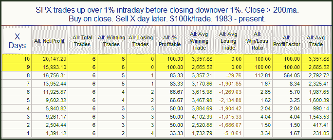

<!--yml
category: 未分类
date: 2024-05-18 13:00:08
-->

# Quantifiable Edges: From 1% Up Intraday to 1% Down Close

> 来源：[http://quantifiableedges.blogspot.com/2010/05/from-1-up-intraday-to-1-down-close.html#0001-01-01](http://quantifiableedges.blogspot.com/2010/05/from-1-up-intraday-to-1-down-close.html#0001-01-01)

Below is a study that appeared in last night's Subscriber Letter that looks at Tuesday's volatile action.

A few notes:

1) While results are explosive, instances are very low. Rather than including this among my Active Studies List I have simply decided to track it going forward.

2) Without the 200ma filter the results are no longer bullish. There were some big declines followingthis type of action during a downtrend.