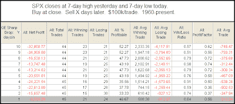

<!--yml
category: 未分类
date: 2024-05-18 13:19:13
-->

# Quantifiable Edges: From A High to a Low in 1 Day

> 来源：[http://quantifiableedges.blogspot.com/2009/06/from-high-to-low-in-1-day.html#0001-01-01](http://quantifiableedges.blogspot.com/2009/06/from-high-to-low-in-1-day.html#0001-01-01)

I

[noted in a tweet last night](http://twitter.com/qerob)

that big moves down are more short-term bullish when they aren’t occurring from a high. This was a bit of an understatement. They’re often short-term bearish. Yesterday’s drop moved the S&P 500 from a 10-day closing high to a 10-day closing low. Since 1960 there have been only 10 other times this has happened. In last night’s

[Subscriber Letter](http://www.quantifiableedges.com/gold.html)

I show the results of those 10 instances.

To get a larger sample size I also reduced the requirements from a 10-day high and low to a 7-day high and low. Those results are below. (Click table to enlarge.)

These results suggest more downside, especially over the next 2-4 days.

For more discussion on big drops from highs you may want to review

[this former study](http://quantifiableedges.blogspot.com/2009/02/importance-of-positioning-in-analysis.html)

.

P.S. I just noticed that Dr. Brett also looked at the 10-day high to 10-day low move this morning.

[See what he has to say here](http://traderfeed.blogspot.com/2009/06/ten-day-high-followed-by-ten-day-low.html)

.