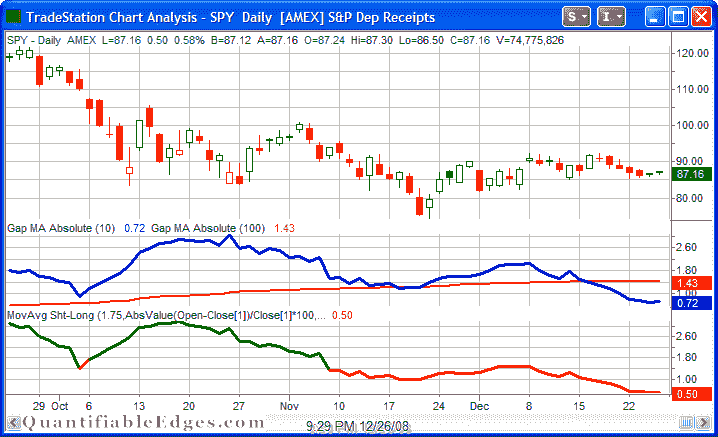

<!--yml
category: 未分类
date: 2024-05-18 13:31:13
-->

# Quantifiable Edges: Gap Shrinkage & What It Suggests

> 来源：[http://quantifiableedges.blogspot.com/2008/12/gap-shrinkage-what-it-sggests.html#0001-01-01](http://quantifiableedges.blogspot.com/2008/12/gap-shrinkage-what-it-sggests.html#0001-01-01)

Measures of volatility I provide charts of in the

[subscriber’s section](http://www.quantifiableedges.com/members/charts.php)

of the website include the Absolute Average Gap of the SPY and Nasdaq. The current chart for the SPY may be found below. Note how it has gone from extremely volatile relative to the norm to extremely muted.

The 10-day Average Absolute Gap moved to less than ½ the 100-day average absolute gap last week. Since 1993 there have been 221 days where the 10-day reading has been less than half the 100-day reading. The average performance on the day following such low readings has been negative 0.035%.

Taking a broader view of this indicator I broke it down by times the 10-day exceeded the 100-day average absolute gap and times the 100-day exceeded the 10-day. When the 10-day has exceeded the 100-day (signifying the market has been subject to gap more than usual as of late) the average 1-day return for the SPY was 0.027% . When the SPY was gapping less than usual (the 10-day was less than the 100-day) the average 1-day SPY return was 0.018%. In other words the market has performed 50% better following periods when is has been more gappy than average vs. times when it’s been less gappy than average.