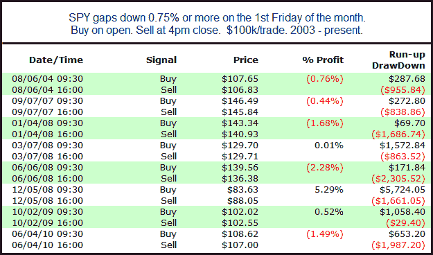

<!--yml
category: 未分类
date: 2024-05-18 12:56:03
-->

# Quantifiable Edges: Gaps Down on Jobs Day

> 来源：[http://quantifiableedges.blogspot.com/2010/08/gaps-down-on-jobs-day.html#0001-01-01](http://quantifiableedges.blogspot.com/2010/08/gaps-down-on-jobs-day.html#0001-01-01)

The SPY is about 0.9% below yesterday's close with 10 minutes to go until the open. Below is a quick test that looks at other instances of large gaps lower on the 1st Friday of the month (typically the day of the jobs report).

