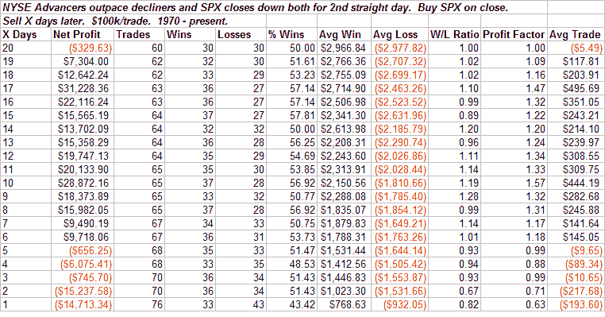

<!--yml
category: 未分类
date: 2024-05-18 13:39:44
-->

# Quantifiable Edges: Good Breadth On Down Days Is No Silver Lining

> 来源：[http://quantifiableedges.blogspot.com/2008/09/good-breadth-on-down-days-is-no-silver.html#0001-01-01](http://quantifiableedges.blogspot.com/2008/09/good-breadth-on-down-days-is-no-silver.html#0001-01-01)

Haven’t done any mythbusting in quite a while.

Wednesday saw the S&P 500 fall while advancing stocks outnumbered declining stocks. This is the 2nd day in a row this has occurred. Most people will tell you that positive breadth readings on down days suggest bullish implications. I decided to look and see what happened following back to back days of good breadth and lower index prices since 1970.

You could interpret the study as negative. You could interpret the study as a mild underperformance of long-term drift. You could even say it’s basically neutral. Bullish though? I see nothing bullish in the above numbers.

I also looked at performance following single days. It wasn’t much better and still underperformed the long-term drift of the market. Positive breadth on a down day should not be considered a silver lining.

Welcome back Adam and Jamie…

