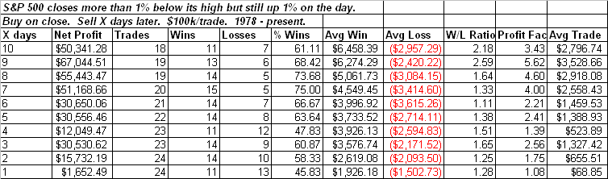

<!--yml
category: 未分类
date: 2024-05-18 13:24:24
-->

# Quantifiable Edges: Good Days With Bad Finishes

> 来源：[http://quantifiableedges.blogspot.com/2009/04/good-days-with-bad-finishes.html#0001-01-01](http://quantifiableedges.blogspot.com/2009/04/good-days-with-bad-finishes.html#0001-01-01)

Finishes like Tuesday’s often feel bearish to many traders. They interpret the inability of the market to hold on to its gains as a potential negative. In actuality, while the market may struggle over the next 1-2 days, over the course of the next 1-2 weeks implications appear bullish.

Below is a table showing the result of buying any time the S&P closes over 1% below its high for the day but still positive by at least 1%:

Between 5 an 9 days out you’ll notice some strongly bullish results. Not visible in the above table is that 19 of 24 instances (79%) posted a close higher than the trigger day within 3 days. Looking out 6 days that number increases to 23 of 24 instances (96%).