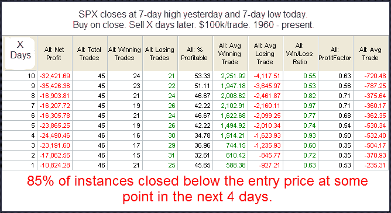

<!--yml
category: 未分类
date: 2024-05-18 13:06:46
-->

# Quantifiable Edges: High To Low In 1 Day Revisited

> 来源：[http://quantifiableedges.blogspot.com/2010/01/high-to-low-in-1-day-revisited.html#0001-01-01](http://quantifiableedges.blogspot.com/2010/01/high-to-low-in-1-day-revisited.html#0001-01-01)

One study that popped up in the Quantifinder Friday night is from the 6/16/09 blog post. It looked at quick moves from a high to a low. I’ve updated that study below:

Such sharp moves from a high level often see spillover in the following days.