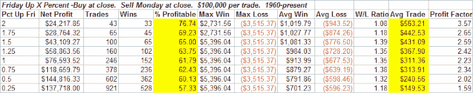
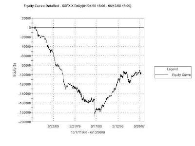
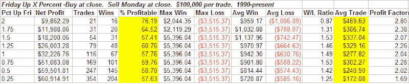

<!--yml
category: 未分类
date: 2024-05-18 08:14:41
-->

# Quantifiable Edges: How Strong Fridays Have Influenced Mondays

> 来源：[http://quantifiableedges.blogspot.com/2008/06/how-strong-fridays-have-influenced.html#0001-01-01](http://quantifiableedges.blogspot.com/2008/06/how-strong-fridays-have-influenced.html#0001-01-01)

On Friday the market put in some solid gains. The S&P 500 rose 1.5%, the Dow 1.4% and the Nasdaq 2.1%. In Gary Smith’s 1999 book,

[“How I Trade For A Living”](http://www.amazon.com/How-I-Trade-Living/dp/B000WGC8ZW/ref=sr_1_1?ie=UTF8&s=books&qid=1213581935&sr=1-1)

, Gary, pictured at the right*, discussed how strong momentum on Fridays has a tendency to carry over to Mondays. If you’ve read the blog for any period of time, you’ll know that I tend to believe very little of what I read about the market. Hence my desire to test everything. So I put Gary’s theory to the test.

Tests were run on the S&P 500 going back to 1960\. The table below shows the percent return on Friday in the left–most column. After that you see the breakdown of what happened on Monday. (Buying Friday’s close and selling Monday’s close.) Also, you should note that if Monday was a holiday, then the sale occurred on Tuesday’s close.

Looks like Gary (pictured above)* was on to something. Especially interesting is the fact that the stronger Friday is, the stronger on average Monday is. You can see this by looking at the average trade column.

But with the long term upward drift of the stock market how have these Mondays compared to the average Mondays? Believe it or not, Mondays since 1960 have been horrible. During the 60’s, 70’s, and 80’s, Mondays were consistent losers for the stock market. After the crash of ’87 (which happened on a Monday), they no longer acted as a consistent loser. Instead they fell more in line with general market direction. This can clearly be seen in the graph below showing all which shows the result of purchasing at Friday’s close and selling at Monday’s close over the last 48 years or so.

For the entire 48 year period the average Monday lost 0.04%. But when Friday’s were strong that momentum tended to carry through and turn Mondays positive. Since the end of the 80’s the advantage has been less pronounced, but still exists. The last table below again shows Mondays returns based on Fridays returns, but this time only back to 1990.

* Not really Gary Smith. Actually that’s Spongebob Squarepant’s pet, Gary the Snail.