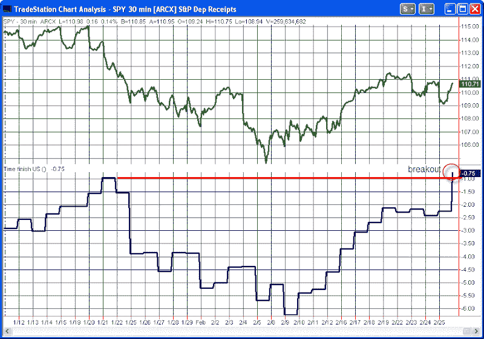

<!--yml
category: 未分类
date: 2024-05-18 13:04:15
-->

# Quantifiable Edges: How The US Has Traded Since The January Highs When Europe Is Closed

> 来源：[http://quantifiableedges.blogspot.com/2010/02/how-us-has-traded-since-january-highs.html#0001-01-01](http://quantifiableedges.blogspot.com/2010/02/how-us-has-traded-since-january-highs.html#0001-01-01)

Much of the time when the market has had bad days as of late people have pointed to troubles in Greece and Europe as the reason. I decided to isolate the US market a bit to see how much of the selling really could be attributed to Europe’s woes. The top pane of the chart shows closing half-hour readings for the SPY from the market top in the middle of January through Thursday’s close. The bottom pane shows an indicator that measures the movement of the US market from the time Europe is all closed at 11:30 EST until the NYSE closes at 4pm EST.

As you can see, while SPY is still down around 4% from its January highs, the 11:30 – 4:00 SPY broke out Thursday above the January highs.

I haven’t quantified what that may mean for the market moving forward but I’d love to hear others thoughts and interpretations...