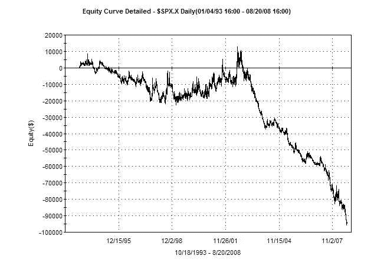

<!--yml
category: 未分类
date: 2024-05-18 13:40:50
-->

# Quantifiable Edges: How To Trade The Choppiest Environment In 50 Years

> 来源：[http://quantifiableedges.blogspot.com/2008/08/how-to-trade-choppiest-environment-in.html#0001-01-01](http://quantifiableedges.blogspot.com/2008/08/how-to-trade-choppiest-environment-in.html#0001-01-01)

If you trade trend or breakout strategies and have found the market difficult in the last year or so, I’m about to show a prime reason for that diffuclty. Below is a strategy that buys the S&P 500 on the close of any up day. The position is closed at the close of a down day. Essentially your looking to buy strength and sit out weakness.

This strategy worked well in the 90’s, but since the market topped in 2000, it has performed poorly. Since the Spring of 2007 it has really accelerated lower. What this means is that performance following up days has been especially bad. It suggests the environenment has been especially choppy. Whereas strength begat strength in the 90’s, it has led to immediate weakness since.

Now let’s take a look at downside follow through. In this case the strategy is to sell short on any down day and then cover on an up day.

This was a break-even strategy through July of 2002\. Since then it has done terrible. Interestingly, it’s done especially bad over the last year plus. Even though the market has fallen precipitously, the manner in which it has occurred has made it difficult to profit if you’re trying to short breakdowns. Down days have been followed by up days.

What about a combination strategy? Buy strength and short weakness in anticipation of further follow through. Below is a chart with the combo strategy:

Again, since March 2007 this strategy would have experienced an incredible freefall.

Perhaps it would be best to take a step back, though. In the next chart I show back to 1960 instead of 1993 in an effort to find other periods where choppiness has been so prevalent.

As you can see, buying after strong days and selling after weak ones worked well for 40 years. In 2000 that changed, and the last year and a half is the worst it has ever been with regards to follow through. This would suggest that strategies that may have worked well for forty years or more could be suffering greatly now. Traders should consider the current choppy market behavior when designing strategies. Buying weakness and selling strength is working better than buying strength and selling weakness. They could also monitor charts like these to see if tendencies begin to revert back to pre-2000\. If tendencies do revert, adjustments may be needed.

-----------------------------------------------------------------

Update: I just saw that Dr. Brett Steenbarger also addressed this topic in his blog today. He looked at it from an international standpoint as well.

[Click here](http://traderfeed.blogspot.com/2008/08/short-term-reversal-patterns-among.html)

to see his findings.

---------------------------------------------------------------------