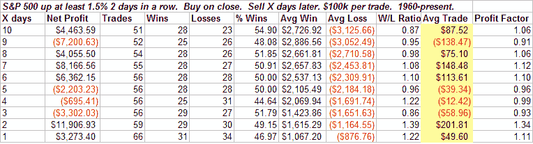
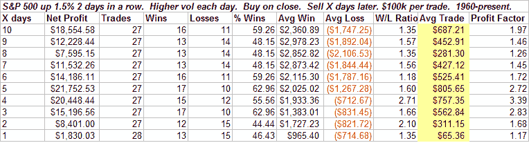
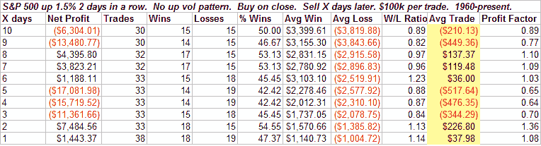
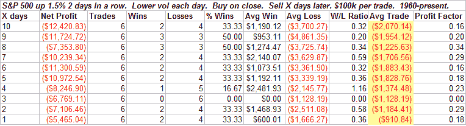
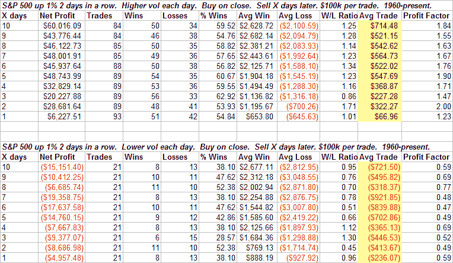

<!--yml
category: 未分类
date: 2024-05-18 08:11:07
-->

# Quantifiable Edges: How Volume Provides Clues & What It's Suggesting

> 来源：[http://quantifiableedges.blogspot.com/2008/07/how-volume-provides-clues-what-its.html#0001-01-01](http://quantifiableedges.blogspot.com/2008/07/how-volume-provides-clues-what-its.html#0001-01-01)

Tonight I thought I’d show an example of how volume can affect price action. The last two days the S&P 500 has risen by over 1.5%. Volume has also risen each of the last two days. Ignoring volume I ran a test to see how the S&P performed after back to back 1.5% rises:

Results were choppy and even the better periods generally underperformed a random 1-2 week period.

Next I looked at what happened if the volume rose both days as it has the last 2:

Generally positive results. Nothing eye-popping but “worse than random” has turned to a positive bias.

What if I look at only those times when the market was up 1.5% for two days in a row and there wasn’t a progressively higher volume pattern?

As you’d expect, things have gone from choppy to choppy with a slight downside bias.

What if instead of rising two days in a row, we look at the same price pattern where volume sank two days in a row?

A gently positive bias with rising volume becomes a violently negative bias on decreasing volume. Of course the number of instances here is quite small. To remedy this I lowered the price requirement from 1.5% to 1%. Results below:

Similar story here. Any way you look at it, the moral is this: Pay attention to volume. It matters.

As a bit of a tease I’ll let everyone know that I’m currently conducting a large research project related to volume. I hope to be able to release results some time in August.