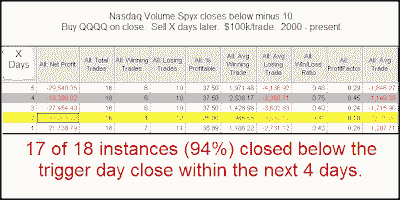

<!--yml
category: 未分类
date: 2024-05-18 13:16:42
-->

# Quantifiable Edges: In Indicator Suggesting Short-term Downside

> 来源：[http://quantifiableedges.blogspot.com/2009/08/in-indicator-suggesting-short-term.html#0001-01-01](http://quantifiableedges.blogspot.com/2009/08/in-indicator-suggesting-short-term.html#0001-01-01)

One indicator I track on the website is the Nasdaq Volume Spyx. The volume Spyx calculation is proprietary but in general it looks at relative volume across multiple Nasdaq securities. Historically, very low readings have often been followed by quick declines and high readings have been followed by quick bounces. Below is a copy of the chart from the website.

(click to enlarge)

As you can see, the -13.76 reading is quite unusual. I ran a test back to 2000 to see how the QQQQ has performed following other readings below -10.

(click to enalarge)

While instances are a bit low there appears to be a significant downside edge over the next 2 days.