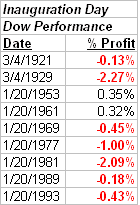
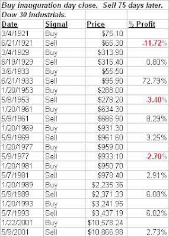

<!--yml
category: 未分类
date: 2024-05-18 13:29:27
-->

# Quantifiable Edges: Inauguration Day - A New Hope For The Market?

> 来源：[http://quantifiableedges.blogspot.com/2009/01/inauguration-day-new-hope-for-market.html#0001-01-01](http://quantifiableedges.blogspot.com/2009/01/inauguration-day-new-hope-for-market.html#0001-01-01)

Many people throughout the United States and the world are viewing the inauguration today with a sense of hope. Hope that things (whatever things are important to each individual) are going to get better. This sense of hope is not unique to Barack Obama. It comes with every new President to take office. The question for us as traders is, “How has this sense of hope translated to stock market returns?”

I decided to look back to 1920 using the Dow to see how the market has reacted to past inaugurations. I limited the instances to only those inaugurations where a new president was entering office. I don’t think re-elections carry a sense of “new hope” the way a new president does. I also eliminated inaugurations of Presidents that weren’t elected (Ford in ’74, Johnson in ’63, Truman in ’45, and Coolidge in ‘23). I just don’t believe the same sense of excitement is generated by a replacement as by a newly

*elected*

president.

That left me with the following 11 instances:

March 4, 1921 - Warren G. Harding

March 4, 1929 – Herbert Hoover

March 4, 1933 – Franklin Roosevelt

January 20, 1953 – Dwight Eisenhower

January 20, 1961 – John Kennedy

January 20, 1969 – Richard Nixon

January 20, 1977 – James Carter

January 20, 1981 – Ronald Reagan

January 20, 1989 – George H.W. Bush

January 20, 1993 – William Clinton

January 20, 2001 – George W. Bush

First I looked to see how the market performed on the day of the inauguration. Surely the wonderful speeches and overall positive vibes would have had a positive affect on the market:

Then again, perhaps not. Eisenhower wins the award for most market-friendly speech by juicing the Dow for 0.35%. Herbert Hoover’s presidency got off to a bad start immediately as the Dow lost over 2% on the day he was sworn in. (And we all know it got much worse after that.) George W. Bush and Franklin Roosevelt are not included on the list since their 1st inaugurations were on weekends.

What if we look out a little longer, though? Buying on the close of inauguration day (or 1st day after for W. Bush and Roosevelt) and holding for 10 days offered significantly more positive results:

82% winners and an average return of 2.35% over the 10 days suggests a bullish bias. Roosevelt is the hero here. Carter is the goat. Overall downside was limited and upside was fairly strong. The last 3 have been especially good.

For an intermediate-term perspective below are the results for the 1st 75 trading days of the new presidency:

Mostly positive here. Obviously what stands out in these results is the 1933 mega-rally. The market bottomed in July of 1932 near 40\. After spiking to over 80 by mid-September it began to pull back again hard. In February of 1933 it dipped back below 50 – less than a week before Roosevelt took office. That dip led to another massive rally as prices went up about 120% in the next 5 months. Even that rally didn’t pull the economy out of the depression. And as nice as those 5 months must have been the market then settled into a range lasting about 10 years. It wasn’t until the 4th quarter of 1942 that the 1933 high around 110 was surpassed for the final time.

I’ve shown numerous studies the past few months comparing the current environment to the 1930’s. Perhaps the sense of hope brought on by new leadership today could help to ignite a strong (bear market) rally as it did 76 years ago.

Of course the main issues with this line of tests is that we are dealing with only 11 instances in 90 years. It would be quite dangerous to base any trades on just these results. I do find them interesting and somewhat notable, though.