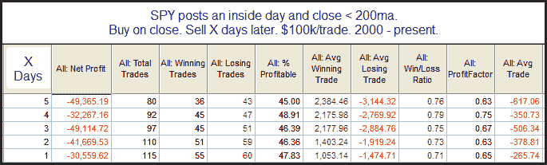
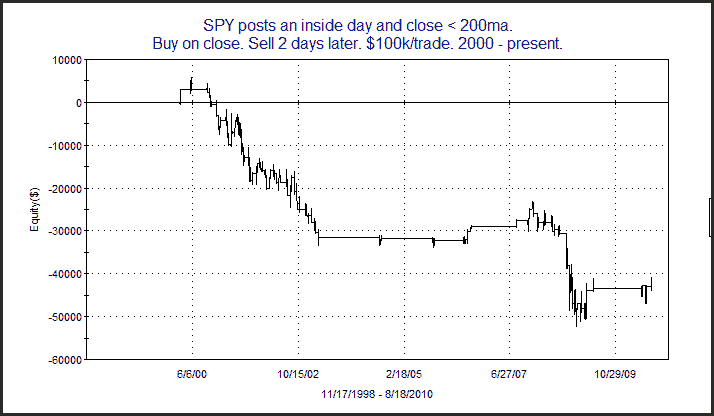

<!--yml
category: 未分类
date: 2024-05-18 12:55:35
-->

# Quantifiable Edges: Inside Days

> 来源：[http://quantifiableedges.blogspot.com/2010/08/inside-days.html#0001-01-01](http://quantifiableedges.blogspot.com/2010/08/inside-days.html#0001-01-01)

Wednesday the market posted an inside day. I haven't discussed inside days in a while. For those unfamiliar an inside day is simply a day that makes a lower high and a higher low than the day before. Over the last decade, when the market has been trading below the 200ma, inside days have suggested negative short-term implications. Below is a table that demonstrates this.

Of course there are other nuances and filters that could be applied that could increase or decrease this edge. But generally there has been a poor track record following inside days. It's been fairly steady, too. This can be seen in the equity curve below which uses a 2-day holding period.

