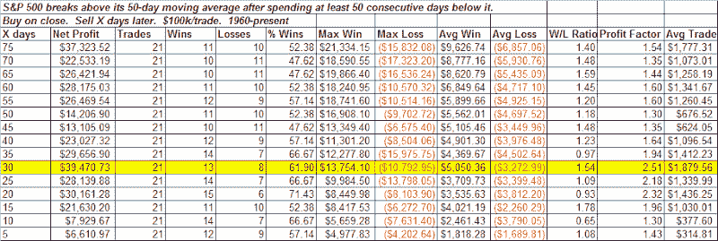

<!--yml
category: 未分类
date: 2024-05-18 13:31:38
-->

# Quantifiable Edges: Is The Break Above The 50-day MA Likely To Ignite A Strong Rally?

> 来源：[http://quantifiableedges.blogspot.com/2008/12/is-break-above-50-day-ma-likely-to.html#0001-01-01](http://quantifiableedges.blogspot.com/2008/12/is-break-above-50-day-ma-likely-to.html#0001-01-01)

The big Fed rally on Tuesday pushed the S&P 500 above its 50-day moving average for the 1st time since September.

[Bespoke](http://bespokeinvest.typepad.com/bespoke/2008/12/more-on-the-sp-500s-50dma.html)

put together some stats on how long other downtrends have remained below their 50-day moving average. I was curious to see how the S&P has performed in the past when it’s risen through its 50-day moving average after spending a lengthy period of time below it. Is it likely to spark a buying spree?

After other similar circumstances the positive edge only lasted about 6 weeks. (Note the Average Trade column peaks at 6 weeks.) Over the 6-week period the average gain is only 2%. Winners gained 5% on average, which isn’t terrible. I also found it notable that the maximum gain was 13.75% for the subsequent 6 weeks. For some perspective, since the November bottom 4 weeks ago the S&P is up about 22%. For the market to match the performance of the last 4 weeks over the next 6 it will need to do about 160% better than it ahas ever done under similar circumstances. Looking out 15 weeks (75 days), the market still has never rallied 22% after spending 50 or more days below the 50-day moving average.

Also interesting is that the worst 6 weeks was down less than 11%. This suggests a trading range may be more likely than a runaway move up or down.

To baseline the results a little bit I also looked at 50ma crosses when the S&P hadn’t spent at least 50 days below the average:

Nothing Earth-shattering but it outperforms the 1st scenario over most time periods and the gains are certainly much steadier.