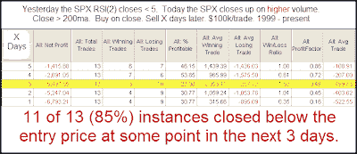
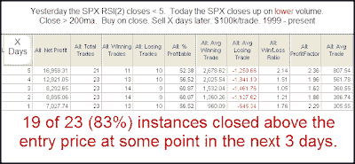

<!--yml
category: 未分类
date: 2024-05-18 13:14:31
-->

# Quantifiable Edges: Is Thursday's Low Volume Troubling?

> 来源：[http://quantifiableedges.blogspot.com/2009/09/is-thursdays-low-volume-troubling.html#0001-01-01](http://quantifiableedges.blogspot.com/2009/09/is-thursdays-low-volume-troubling.html#0001-01-01)

In last night’s

[Subscriber Letter](http://www.quantifiableedges.com/gold.html)

I examined whether the relatively low volume on Thursday’s bounce should be concerning. I examined it a few different ways. Below is one series of tests I showed. First let’s look at what happened when volume came in higher on a bounce following some severe short-term oversold conditions.

(click table to enlarge)

Interesting that the high volume bounces failed to follow through. The number of instances is a bit low but the numbers are fairly compelling anyway. Let’s see how this compares to low volume bounces:

(click table to enlarge)

Here the results have a solid bullish tilt.

These tests suggest that Thursday’s light volume should not be of any concern. In fact, it may be a market positive.